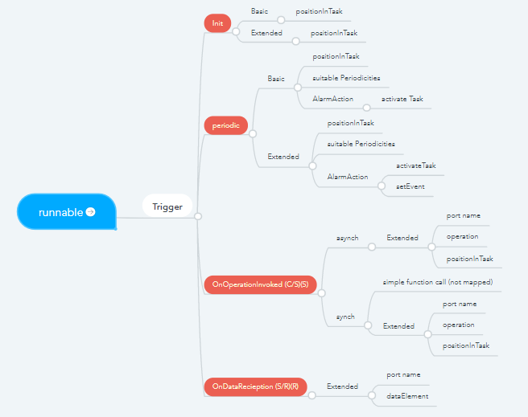
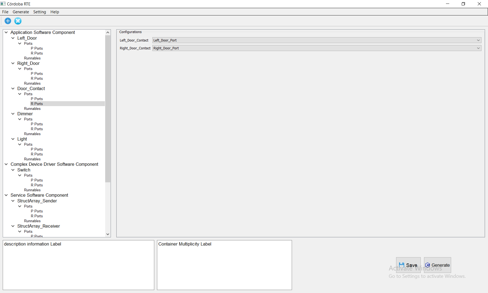
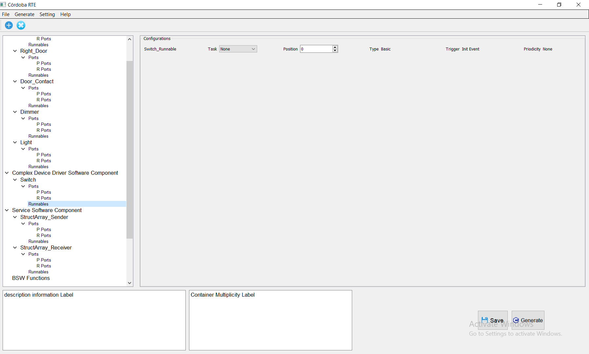
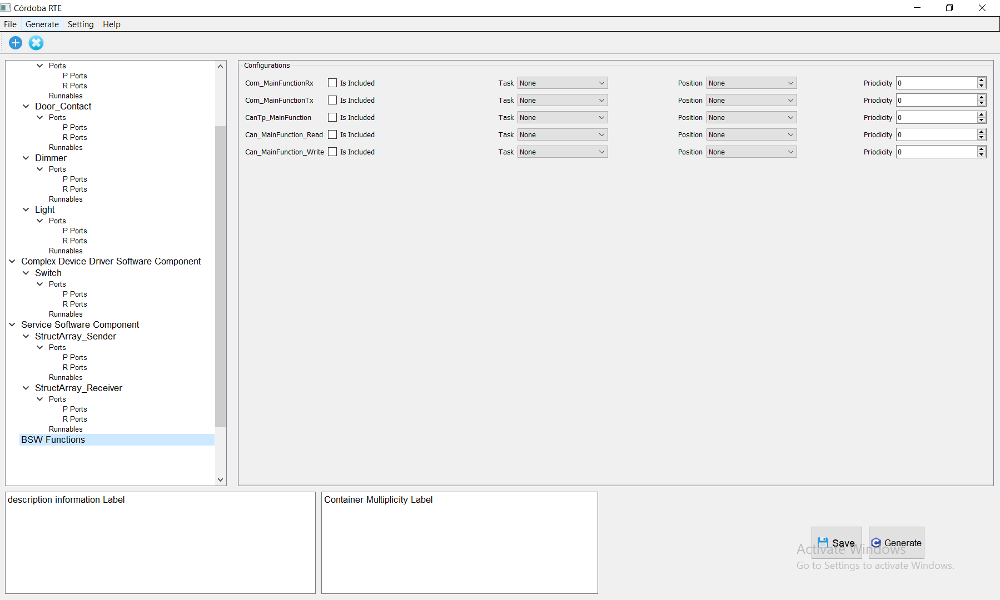

# Cordoba RTE Tool

## Table of Contents
- [Intro](#Intro)
- [Setup](#Setup)
- [Knowledge](#knowledge)
- [Provided Tool](#Provided-Tool)

## Intro

<h4 align="center">An open source educational tool for Configuring and Generating RTE.</h4>

The RTE connects Application Software components, Basic Software components, services and Complex Device Drivers.

Cordoba RTE Tool Project is written with Python 3 and PyQt 4.

The input for this tool are The arxml files from the AUTOSAR Studio and The BSW Tool for OS and Comm. 

## Setup

Clone this repository on your machine.

    git clone https://github.com/mAbdelhay/Rte_Tool.git
Open your terminal and navigate to the repo's directory.

    cd ./Rte_Tool
Double Click on control_window.py
or
open CMD and run the command below

    python control_window.py
    
## Knowledge

### What is RTE?
The Run-Time Environment (RTE) is at the heart of the AUTOSAR ECU architecture. The
RTE realizes the Virtual Function Bus (VFB) interfaces by implementing the communication
of software components and the scheduling of software components as generated code (usually
C-code). Where the VFB view is independent of ECU boundaries, the RTE is dedicated to
specific ECU (ECU configuration).

The communication interface of an AUTOSAR software-component consists of several ports.An AUTOSAR software-component can
communicate through its interfaces with other AUTOSAR software-components (whether that
component is located on the same ECU or on a different ECU). This communication can only occur via the
component’s ports. 

### RTE generation process
The RTE generation process consists of two distinct phases:
1) RTE Contract phase
2) RTE Generation phase

#### RTE Contract phase
Limited set of information about a component, principally the AUTOSAR interface definitions,
is used to create an application header file for a component type. The application header file
defines the “contract” between component and RTE.

  

<h4 align="center">RTE Contraact phase</h4>

#### RTE Generation phase

All relevant information about components, their deployment to ECUs and communication
connections is used to generate the RTE. One RTE is generated for each ECU in the system.

  

<h4 align="center">RTE Generation phase</h4>
  
#### Runnable to Task mapping

  

<h4 align="center">Runnable to task mapping</h4>

  
## Provided Tool

  

<h4 align="center">RTE Tool</h4>

  

<h4 align="center">RTE Tool</h4>

  

<h4 align="center">RTE Tool</h4>
